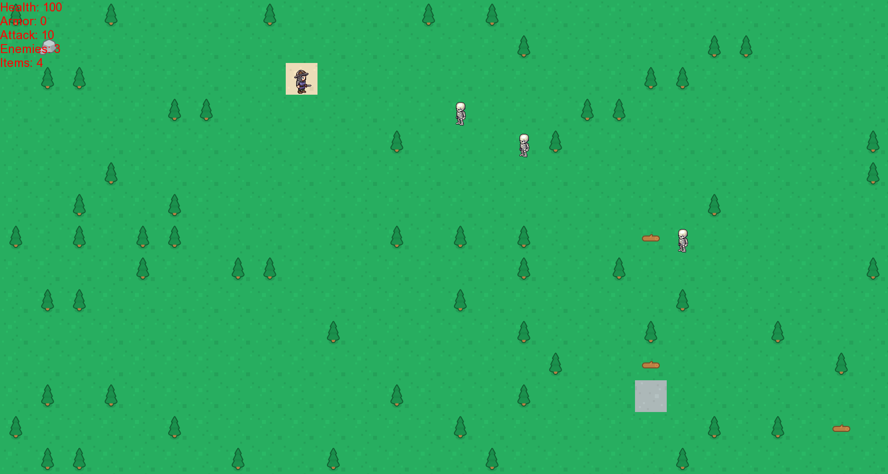

# Grid Game

Простая пошаговая 2D игра, целью которой является с песчаной клетки дойти до каменной, избегая встречи с врагами.

### Использованные технологии
Игра написана на С++ с использованием библиотеки SFML.

### Правила и управление
Герой появляется на песчаной клетке, ваша цель - дойти до каменной клетки.
Для передвижения используйте кнопки со стрелками. После вашего хода враги автоматически передвигаются на 1 клетку в
вашем направлении. При встрече с врагом на одной клетке у героя отнимается здоровье, при падении здоровья до 0 игра заканчивается.
Подбирайтей бревна для увеличения здоровья на небольшое значение.